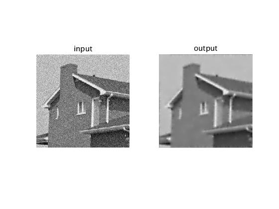
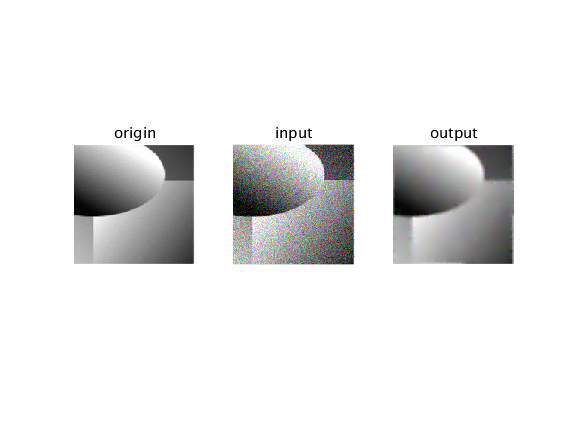

<!--
 * @Description: Do not edit
 * @Author: MathCoder
 * @Date: 2019-12-08 18:14:18
 * @LastEditors: MathCoder
 * @LastEditTime: 2019-12-08 19:21:02
 -->

# 计算机图形学

## Program assignment 2

### PRINCIPLE

Solve the specific obejctive function:

$$\mathop{\arg\min}\limits_{u}\parallel \Delta u \parallel _1 + \frac{\alpha}{2}\parallel u-u^0\parallel _2^2$$

We use the method of Augmented Lagrange to construct $L(u,p,\lambda)$.

Specifically, we solve this minimization problem by alternating three sub-problems as follows:

$u-$problem:

$$\mathop{\arg\min}\limits_{u}\frac{\alpha}{2}\parallel u-u^0\parallel _2^2+\frac{r}{2}\parallel \Delta u-(p^k +\frac{\lambda ^k}{r}) \parallel _2^2$$

$p-$problem:

$$\mathop{\arg\min}\limits_{p}\parallel p \parallel _1 +\frac{r}{2}\parallel p-(\Delta u^{k+1}-\frac{\lambda ^k}{r}) \parallel _2^2$$

$\lambda-$update:

$$\lambda ^{k+1} = \lambda ^k+r(p^{k+1}-\Delta u^{k+1})$$

### OUR RESULTS

E.g,the original image with noise:

E.g.,I add noise in the original image:

### CODE

More implementation details see MATLAB code.

### REFERENCES

1. The paper of AUGMENTED LAGRANGIAN METHOD FOR TOTAL VARIATION RESTORATION WITH NON-QUADRATIC FIDELITY

2. the paper of Image Smoothing via L0 Gradient Minimization

